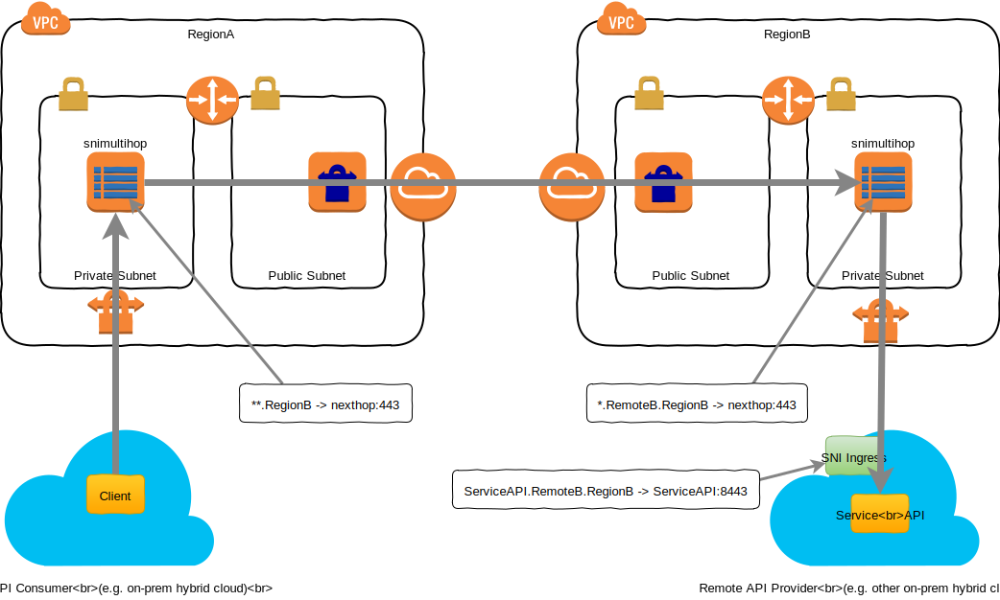

# snimultihop - SNI Multi-Hop Router

|  |  |
|-|-|

Based on original work
[tlsrouter by Google](https://github.com/google/tcpproxy/tree/master/cmd/tlsrouter).

Experimental Multi-hop SNI routing for unbroken end-2-end TLS encrypted
API calls (e.g. to a Kubernetes SNI enabled Ingress Controller).



## Configuration
```
# Examples:
#
# Route by region
#   **.uk ukrelay.example.com:443
#
# Route by Ingress Controller
#   *.mycustomer.uk ingress.customer.com:443
# at this point the Kubernetes SNI Ingress Controller can route to the
# requested service internally.
```

## Developer Notes

Fire up two mock SNI routers in Vagrant
```bash
vagrant up
```

Build snimultihop:
```bash
vagrant ssh snimultihop-dev-1
vagrant> cd go/src/github.com/gbevan/snimultihop
vagrant> go build .
```

Start SNI router 1
still in vagrant snimultihop-dev-1 from above:
```bash
vagrant> ./snimultihop -conf test-1.conf -listen :8443
```
and in another terminal
```bash
vagrant ssh snimultihop-dev-2
vagrant> ./snimultihop -conf test-2.conf -listen :8443
```

The test2.conf points to my kubernetes SNI ingress for testing.

Curl example:
```bash
curl -sSk \
  --resolve snivault.default.pod:8443:127.0.0.1 \
  https://snivault.default.pod:8443/v1/sys/health \
  | jq
```
```json
{
  "initialized": true,
  "sealed": false,
  "standby": true,
  "performance_standby": false,
  "replication_performance_mode": "disabled",
  "replication_dr_mode": "disabled",
  "server_time_utc": 1552751306,
  "version": "0.11.4",
  "cluster_name": "vault-cluster-f5b81a91",
  "cluster_id": "aa52cbab-fa12-edb0-16e0-9586c6af415d"
}

```
